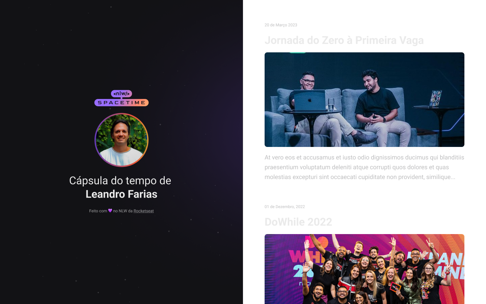

  

## Projeto

O projeto visa ser uma cápsula do tempo, ou um feed de memórias. É um projeto web responsivo, 100% front-end.

## Tecnologias

Esse projeto foi desenvolvido durante a NLW da Rocketseat (Maio/2023), utilizando as seguintes tecnologias:

- HTML
- CSS
- Git e Github

## Layout

Layout do projeto disponível [neste link](<https://www.figma.com/file/ltHHEeG9m8GdHumSrlH2mb/C%C3%A1psula-do-tempo-%E2%80%A2-Trilha-Explorer-(Community)?type=design&node-id=352%3A8&t=esq8r36PeQksF0ub-1>).
Para visualizar, é necessário ter uma conta no [Figma](https://www.figma.com).
